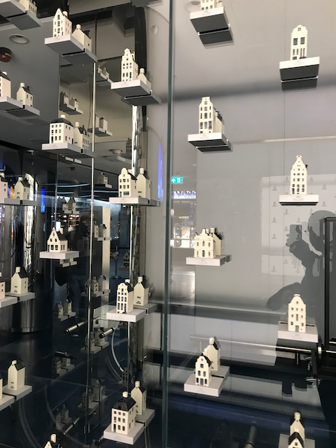

My ramblings about my NY visit starting on the 13th of January 2019

## Departure - Amsterdam

Departure on Sunday the 13rd of Jan at 09:15, my taxi driver arrived at 7:00 since I wanted to checkout the new KLM crownlounge. I know it's not fully finished yet but I was not impressed.... First of all very crowded and second no soy milk available... what!!! I quickly walked by to Privium airside lounge which is much much better.

## Flight - Amsterdam --> NY JFK with Delta

Pretty uneventful. I had ordered the asian vegetarian meal. Very tasteful.
The actual plane was quite old and the video screen super small (or am I spoiled with the Emirates business class screen :-))

## New York
Arrived early at JFK and went through customs in a breeze. Had to wait 15m for my bag to arrive. Ordered a lyft and on my way to Renaissance Mid town my go to hotel for work visits.

Received a nice upgrade and access to the lounge (platinum staus yeah!) and some discount coupons.

Went to the 6pm Hillsong service (5m walk from the hotel) it was good the be 'home'.

## Dinner

Since I started eating vegan about 2 months ago (disclaimer: not religious about it) I searched opentable for the best reviews and decided on XYST NYC on 17th St.

Had an fab meal (tapas style) with croutons with cashew cheese, falafel and beets. Very nice indeed.

